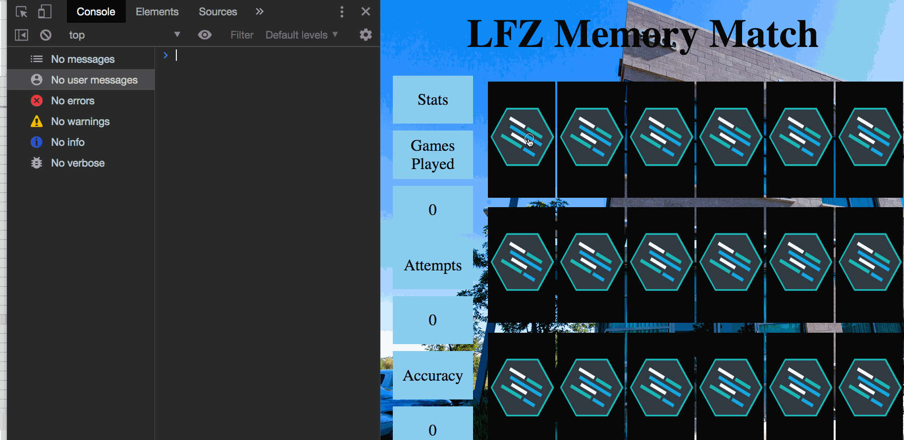
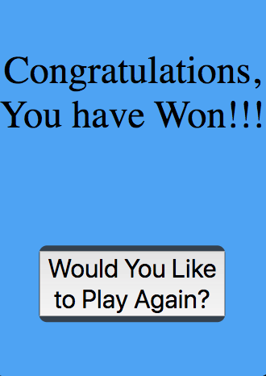
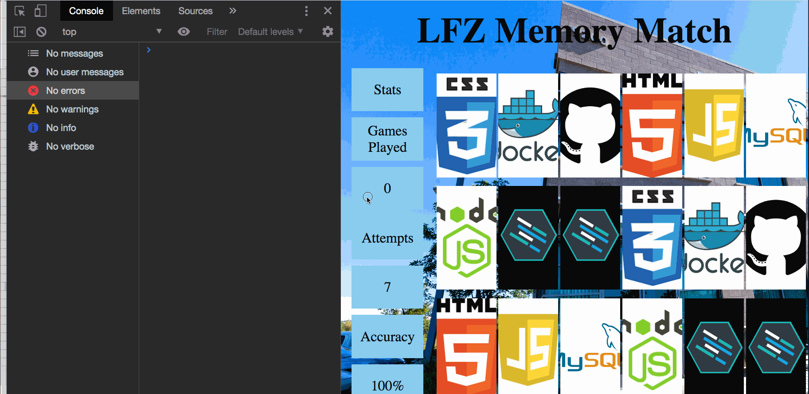

Instructions - User Can Reset Game and Play Again
--

### Overview

In this feature, you are giving the user the ability to reset the game and play again after the game is complete.
  - Let's look at the steps required to complete this feature:
  1. Declare a new function `resetGame` which will reset the `statistic` global variables and increment the `gamesPlayed` global variable.
  2. Declare a new function `resetCards` which will remove the "hidden" class from the `card-back` cards so that they are no longer hidden.
  3. Add a button to the `modal` which will reset the game when clicked.
  4. Add click functionality to the new `modal` button which will call the `resetGame` button on click.
  5. Add functionality to close the `modal` when the reset game button is clicked.
  6. Add functionality to the `calculateAccuracy` function to fix the `NaN` issue.

  - Now that we have the steps required to complete the functionality for this feature, let's get started!

  ## 1. Declare a new function `resetGame` which will reset the `statistic` global variables and increment the `gamesPlayed` global variable.

  - The first step to resetting the game is to declare a new function which will reset the game back to it original state so that the game can be played again.
  - Take a moment and think about the global variables which must be adjusted to their original values in order to reset the game.
  - Also, consider what must be done with the `gamesPlayed` variable once a game is complete.
  - With the above information in mind, declare a new function, `resetGame` in the global space.
    - Within the function:
      - Reset the `statistics` global variables to the proper values for a new game.
      - Increment the `gamesPlayed` variable.
      - Use existing app functionality to update the `stats` text nodes on the DOM.
        - You have a function for this!
    - When the above is complete, test your app by calling the `resetGame()` method in the console.
      - Example functionality:
      
    - When your functionality matches the above, move on to the next step!

## 2. Declare a new function `resetCards` which will remove the "hidden" class from the `card-back` cards so that they are no longer hidden.

  - Now that the `stats` variables are being properly reset, and the DOM is being updated to match the updated variable values, it is time to reset the flipped over cards.
  - Let's take a moment to think about what needs to be done to reset the cards:
    - First, you need to select and store references to each of the cards with the class of `card-back`
      - this is because it is only cards with the class of `card-back` which are hidden.
    - Next, you must loop through each of the cards and remove the class of `hidden`
  - With the above information in mind, declare a new function in the global space, `resetCards`.
  - Within the `resetCards` function:
    - Use the `querySelectorAll` method to select the nodeList of elements with the `class` of `card-back`.
      - Store that nodeList in a variable named `hiddenCards`
      - MDN documentation on the `querySelectorAll` method. [**Click Here**](https://developer.mozilla.org/en-US/docs/Web/API/Document/querySelectorAll)
    - Then, loop through the `nodeList` of `card-back` cards stored in the `hiddenCards` variable:
      - For each iteration of the loop:
        - remove the `hidden` class from the element whose index in the `nodeList` matches the iteration number of the loop
        - W3 Schools documentation on the `classList` property: [**Click Here**](https://www.w3schools.com/jsref/prop_element_classlist.asp)
    - When you have completed the above, test your code by calling the `resetCards` function from the console.
    - Example functionality:
      
    - When the cards flip back over after calling the `resetCards` function, add the function call for the `resetCards` function into your `resetGame` function so that the cards are reset when the `resetGame` function is called.
    - When the above is complete, move on to the next step!

## 3. Add a button to the `modal` which will reset the game when clicked.

  - Now that you have completed the functionality to reset the `statistics` display and to reset the cards, it is time to add a button to the `modal` so that the player can click it and reset the game once they have won.
  - With the above in mind, create a new button in the `modal` using HTML.
  - Example `modal` after update:
  
  - When you have added and styled your button to the `modal`, move on to the next step!

##  4. Add click functionality to the new `modal` button which will call the `resetGame` button on click.

  - Now that you have a reset button, it is time to add click functionality to it so that it will call the `resetGame` function when it is clicked.
  - With the above information in mind:
    - Use JavaScript to add a click event handler which calls the `resetGame` function when the `modal` button is clicked.
      - Make sure to add an `id` to the button for targeting!
  - Example functionality:
  
  - When you have completed the above functionality, move on to the next step!

## 5. Add functionality to close the `modal` when the reset game button is clicked.

  - Now that the `modal` button is correctly calling the `resetGame` function on click, it is time to add functionality which will hide the `modal` when the `resetGame` function is called.
  - With the above information in mind:
    - Add the necessary JavaScript to the end of the `resetGame` function to hide the `modal` when the reset button is clicked.
  - Example functionality:
  
  - When the above is completed and your functionality matches the example, move on to the next step!

## 6. Add functionality to the `calculateAccuracy` function to fix the `NaN` issue.

  - Now that the `modal` is hiding properly and the game is being reset, it is time to fix the `NaN` issue with the `Accuracy` display on reset.
  - The reason for the display of `NaN` is that you are calling the `displayStats` function on reset, and it is trying to calculate accuracy using zero for both `matches` and `attempts`.
  - To fix this, we are going to add a simple conditional check to return a different string from the `calculateAccuracy` function when no attempts have been made to match cards yet.
  - Within the `calculateAccuracy` function:
    - add a conditional statement at the top of the function which returns the string "0%" when the `attempts` variable contains a falsy value.
  - Example functionality:
    
  - When your functionality matches the above, Congratulations!!! you have completed the MVP for the Memory Match Game!!!
  - Move on to the `After The Final Feature` section below.

### After The Final Feature

- When your Memory Match is complete, you will want to save and submit your work to the branch that you have created, and then open a pull request on the Learning Fuze Memory Match repository for review (***Instructions for submission are below!!!***).
  - Use `git status` to check that you are on the correct branch that represents your feature.
  - You will want to **add**, **commit**, and **push** the code that you have written to the appropriate Github repository.
    1. `git add .`
    2. `git commit -m "Description of the feature that you have implemented"`
       - e.g. `git commit -m "Added simple HTML skeleton"`
    3. `git push origin FEATURE_NAME_HERE`
       - e.g. `git push origin skeleton`

- Finally, you will want to create a pull request. This will merge the code from your newly **completed** feature branch into your `master` branch.

  1. Navigate to <kbd>New Pull Request</kbd>:
  
  2. Compare changes to merge:
  
  3. Create a new pull request:
  
  4. Merge the pull request:
  
  5. Update master with the new changes:
  - Note: you must `checkout` to the `master` branch and then `git pull origin master` to update your local `master` branch with the new code you just merged into the remote `master` branch.
  
  6. Create a pull request from your `feature` branch to the `student-reviews` branch and send the pull request to your lead instructor in Slack.
    - You will be deleting this branch only `AFTER` your pull request has been approved!

  7. Go back to [Features](../../README.md#features), if you're still working through the project.

