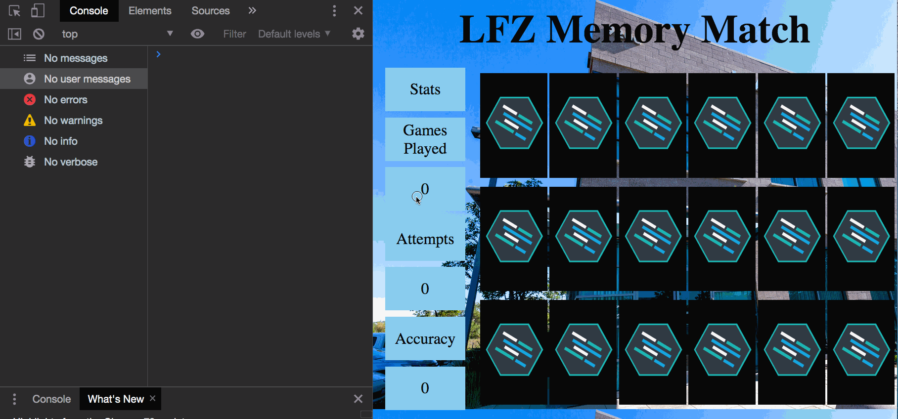
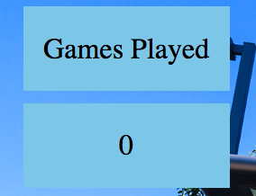
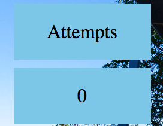
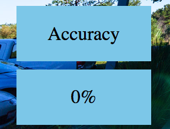
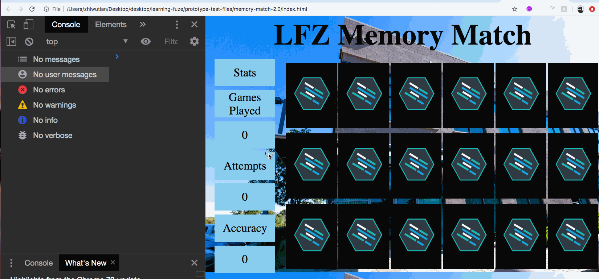
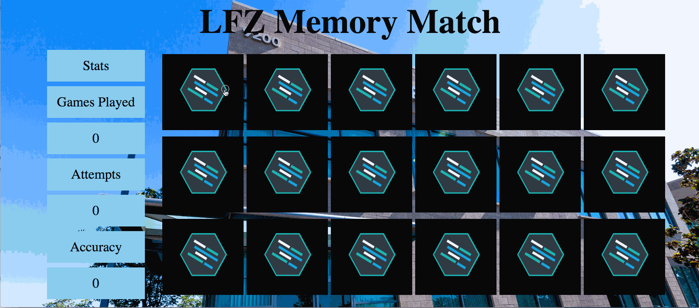
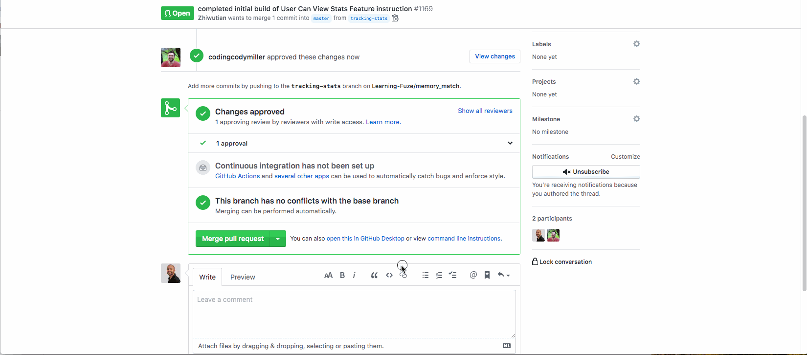

Instructions - User Can View Stats
--

### Overview

- In this feature, you will add the functionality to display statistics on the Memory Match game while it is being played. The following stats will be tracked:
  - The number of games played
  - The number of attempts to match cards
  - The accuracy of the players attempts to match cards

- Let's look at the steps required to complete this feature:

1. Adding new global variables to track the number of games played, and the number of attempted matches.
2. Incrementing the attempts variable.
3. Adding IDs to the text elements which need to display updated statistics information
4. Creating a function which will display the statistics in the proper text elements at the end of each round.
5. Adding the `displayStats` function call to your code so that the stats are updated each round.
6. Creating a function which will calculate the accuracy of the players attempts to match cards.
7. Updating the `calculateAccuracy` function for proper display of accuracy on the DOM.

- Now that we have a list of steps to complete for this feature, let's get started!

## 1. Adding new global variables to track the number of games played, and the number of attempted matches.

- The first thing that needs to be done is preparing to track game statistics is to declare variables which will be used to store the needed statistics information.
- The amount of matches made by the user is already being tracked.
  - matches functionality was completed in the `User Can Win` feature
- So to calculate accuracy of the players attempts to match cards, and the number of games played, we will need two new global variables:
  - attempts
    - Which will be used to track the number of attempted matches
    - and to calculate the accuracy of the players attempts to match cards
  - gamesPlayed
    - Which will be used to track the number of games the player has played.
- With the above information in mind, declare the `attempts` and `gamesPlayed` variables in the global space with initial values of zero.
- When the above is completed, move on to the next step!

## 2. Incrementing the attempts variable.

- Now that you have new global variables to keep track of statistics information, it is time to begin incrementing the `attempts` variable during the game play.
  - `NOTE:` the `gamesPlayed` variable will not be used until the game reset in the next Feature!

- Deciding when to increment the value of the `attempts` variable is the primary goal of this step, so let's take a moment to think about it:
  - Because `attempts` will be used to track the number of times a player attempts to match cards, the `attempts` variable must be incremented by one every time the player attempts a match.
  - With the above information in mind, increment the `attempts` variable in the proper two places of the `handleClick` function to match the example functionality below:
  
  - When you have completed and tested the above functionality, move on to the next step!

## 3. Adding IDs to the text elements which need to display updated statistics information

- With the proper variables declared and ready to store the needed information, it is time to adjust the HTML structure to make targeting the necessary text elements on the DOM effective.
- There are three elements which require Ids for targeting purposes:
  - The text element which will contain the text for the number of games played.
    - Example:

    
  - The text element which will contain the text for the number of attemped matches.
    - Example:

    
  - The text element which will contain the text for the accuracy of the player's attempted matches.
    - Example:

    
- With the knowledge of which elements you will need to target in order to dynamically update the text on the screen, do the following:
  - Add an appropriate `id` to each of the above text elements so that you can target those elements directly using JavaScript to update their text contents.
- When the correct `ids` have been created in the HTML, move on to the next step!

## 3. Creating a function which will display the statistics in the proper text elements at the end of each round.

  - Now that the HTML text elements which will display the statistics information have been given `ids` for JavaScript selection, it is time to create the functionality to update the DOM with statistics information after each round.

  - In your `script.js` file, do the following:
    - Declare a new function, `displayStats` in the global space.
    - Within the function:
      - target the `games played` text element with its new id and set the text content equal to the value contained in the `gamesPlayed` global variable.
      - target the `attempts` text element with its new id and set the text content equal to the value contained in the `attempts` global variable.
      - target the `accuracy` text element with its new id and set the text content equal to dividing the value of the `matches` gloabal variable by the value of the `attempts` variable.
    - When you have completed the above three steps, test your code:
      - To test your code, refresh the app and open the inspector and the console.
      - In the console, call the `displayStats` function.
      - If everything works correctly, your functionality should match the example:
      
    - When you have completed the above and your output matches the example, move on to the next step!
      - Don't worry about the `NaN` output in the accuracy, it is fine for now and will be fixed!

## 4. Adding the displayStats function call to your code so that the stats are updated each round.

  - Now that the text is being updated in the proper text nodes, it is time to add the `displayStats` function call into your code so that the statistics info updates at the correct time.
  - When deciding where a function needs to be called in your code, the most important thing is figuring out when the call needs to happen in relation to the rest of your code.
    - Note that you want to update the statistics information at the completion of each round...
    - So the function call for `displayStats` should occur after the player has attempted to match two cards.
      - This means whether or not the cards match, the displayStats function must be called.
  - With the above information in mind, add the call for the `displayStats` function in the proper places for you code to update the statistics information each time a round completes.
    - Example output:
    
    - When you have added the `displayStats` function call in the correct places so that your stats info updates correctly as you play the game, move on to the next step!

  ## 5. Creating a function which will calculate the accuracy of the players attempts to match cards.

  - Now that your `Stats` info is being properly updated on the page while the game is played, it is time to fix the `accuracy` display to avoid both `NaN` displaying in the text node and the display of very long decimals.

  - To do this, you are going to use a separate function to calculate the accuracy, and then return the calculation result. The result which is returned from the function will be used to update the DOM accuracy text in the `displayStats` function.

    - Start by declaring a new function, `calculateAccuracy` in the global space.
    - The function will have two parameters:
      - attempts
        - Which is the total number of attempted matches.
      - matches
        - Which is the total number of matches
      - Within the function:
        - return `matches` divided by `attempts`
      - To test the initial functionality of the `calculateAccuracy` function:
        - In your `displayStats` function, make the following change:
          - Set the `accuracy` text content equal to the `calculateAccuracy` function call with the `attempts` and `matches` variables as arguments.
        - Refresh the page and play the game.
          - If the functionality has not changed from the previous step, the `calculateAccuracy` function is working correctly.
            - Move on to the next step.
          - If the functionality has changed from the previous step, fix your code and test again!

## 6. Updating the `calculateAccuracy` function for proper display of accuracy on the DOM.

  - Now that the `calculateAccuracy` is handling the calculation for the `accuracy` text node, it is time to modify it for proper percentage display.

  - Within the `calculateAccuracy` function:
    - Modify your code so that percentages are displayed for accuracy as in the following example:
    
    - Here are some hints!
      - One of the problems with dividing in JavaScript is the long trailing decimals which are common.
        - This method is good for removing unwanted decimals after you have calculated the accuracy. [**Click Here**](https://developer.mozilla.org/en-US/docs/Web/JavaScript/Reference/Global_Objects/Math/trunc)
      - You will need to multiply the result of the dividing `matches` by `attempts` by 100 to get the correct percentage as a whole number.
      - You will need to concatenate the `%` character on to your final result from the calculation.
    - When you have completed the above and your percentages are calculating and displaying correctly, Congratulations! You have completed this Feature!
    - Move on to the `After Each Feature` section.

### After Each Feature

- When your feature implementation is complete, you will want to save and submit your work to the branch that you have created.
  - Use `git status` to check that you are on the correct branch that represents your feature.
  - You will want to **add**, **commit**, and **push** the code that you have written to the appropriate Github repository.
    1. `git add .`
    2. `git commit -m "Description of the feature that you have implemented"`
       - e.g. `git commit -m "Added simple HTML skeleton"`
    3. `git push origin FEATURE_NAME_HERE`
       - e.g. `git push origin skeleton`

- Finally, you will want to create a pull request. This will merge the code from your newly **completed** feature branch into your `master` branch.

  1. Navigate to <kbd>New Pull Request</kbd>:
  
  2. Compare changes to merge:
  
  3. Create a new pull request:
  
  4. Merge the pull request:
  
  5. Update master with the new changes:
  - Note: you must `checkout` to the `master` branch and then `git pull origin master` to update your local `master` branch with the new code you just merged into the remote `master` branch.
  
  6. Create a pull request from your `feature` branch to the `student-reviews` branch and send the pull request to your lead instructor in Slack.
    - You will be deleting this branch only `AFTER` your pull request has been approved!

  7. Go back to [Features](../../README.md#features), if you're still working through the project.
